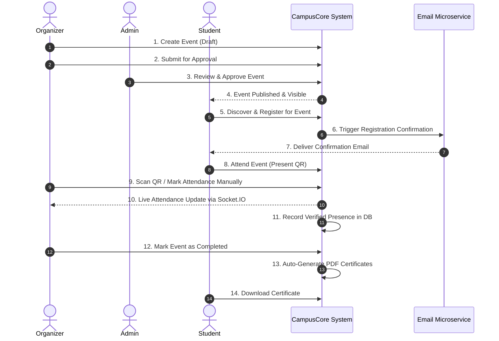

# CampusCore — Comprehensive Project Analysis & Architecture Details

## 1. Executive Overview

CampusCore is a production-grade, full-stack college event management platform built specifically for Sathyabama Institute of Science and Technology. The system handles the complete lifecycle of campus events: from creation, approval, and student registration to live attendance tracking via QR codes, real-time platform-wide announcements, and automated PDF certificate generation upon event completion.

The project is currently undergoing a structural migration (a "Feature Parity Implementation Plan") moving from a legacy monolithic structure (`app_legacy.py`) to a cleaner, modular, service-oriented Application Factory architecture contained within the `app/` directory.

---

## 2. Technology Stack & Dependencies

### Backend
- **Core Framework:** Python 3.11+ with Flask >= 3.0
- **Database:** SQLite (`campuscore.db`) with file-based storage.
- **ORM & Migrations:** Flask-SQLAlchemy >= 3.1 (ORM mapping for 13+ tables) and Flask-Migrate >= 4.0 (Alembic for schema versioning).
- **Real-Time Communication:** Flask-SocketIO >= 5.3 powered by `eventlet`. Handles WebSocket connections for live attendee counters and live floating announcements.
- **Security & Forms:** Flask-WTF >= 1.2 (for form handling and global CSRF protection), Werkzeug (secure filename parsing and password hashing).
- **Authentication:** Authlib >= 1.3 for Google OAuth 2.0 (OpenID Connect).
- **Rate Limiting:** Flask-Limiter for API and route rate limiting.
- **Utilities:** 
  - `ReportLab` & `Pillow` (for automated PDF certificate generation).
  - `Flask-Mail` (for Python-based SMTP emailing).

### Frontend
- **Rendering Engine:** Jinja2 server-side rendering (Pure SSR, no SPA frameworks like React/Vue).
- **Styling:** Custom UI theme (Navy/Gold palette) powered by a 645-line custom stylesheet, augmented with Bootstrap 5.
- **Typography & Iconography:** Google Fonts (Playfair Display + DM Sans) and Font Awesome 6.
- **Interactivity:** Vanilla JS (ES6+) for DOM manipulation, modals, dark-mode toggling, and Socket.IO client (v4.7.2) for WebSocket event ingestion.

### External Microservices
- **Email Microservice:** A dedicated Node.js 18+ microservice using `Nodemailer`. This runs alongside the Flask application to provide a dual-pipeline email delivery system.

---

## 3. Project Structure & Modular Architecture

The new architecture enforces a strict separation of concerns, heavily utilizing Flask Blueprints and a dedicated Service Layer.

```text
campuscore/
├── app/
│   ├── __init__.py          # App factory (create_app)
│   ├── extensions.py        # Extensions (db, migrate, socketio, csrf) singletons
│   ├── models/              # SQLAlchemy ORM models (13+ files)
│   ├── blueprints/          # Route handlers (Controllers)
│   │   ├── admin/           # Admin panel routes
│   │   ├── student/         # Student dashboard routes
│   │   ├── events.py        # Event CRUD routes
│   │   └── auth.py          # Authentication routes
│   ├── services/            # Business Logic Layer (NO direct DB queries in routes)
│   │   ├── analytics.py     # Aggregates registration & attendance data
│   │   ├── announcements.py # Announcement logic and SocketIO emitting
│   │   ├── email.py         # Email routing to Node.js/Flask-Mail
│   │   └── pdf.py           # Certificate generation logic
│   ├── sockets/             # WebSocket event listeners
│   └── templates/           # Jinja2 HTML templates
├── migrations/              # Alembic migration scripts
├── email-service/           # Node.js + Nodemailer microservice
├── app_legacy.py            # Legacy monolith (currently being migrated)
├── requirements.txt         # Python dependencies
└── run.py                   # Application entry point
```

**Development Ground Rules:**
1. **No direct route DB queries:** All SQLAlchemy queries go through `app/services/`.
2. **No direct SocketIO emits from routes:** Emitting occurs in the service layer for testability.
3. **No raw SQL:** Must use `flask db migrate` & `upgrade`.

---

## 4. Comprehensive Workflows

The platform caters to three distinct roles: **Admin**, **Organizer**, and **Student**.

### 4.1 Global Event Lifecycle Workflow



### 4.2 Role-Specific Workflows

#### **Admin Workflow**
1. **Platform Oversight:** Admins log in and view the global **Analytics Dashboard** (built with Chart.js), providing metrics on total events, total registrations, global attendance rates, and category breakdowns.
2. **Event Moderation:** When organizers submit events, they enter a `pending approval` state. Admins review, approve, or reject them with feedback.
3. **Global Announcements:** Admins can compose and broadcast announcements with priorities (`info`, `warning`, `urgent`). These emit via WebSockets to all connected clients instantly as a floating banner.
4. **User Management:** Full CRUD capabilities over student and organizer accounts.

#### **Organizer Workflow**
1. **Event Creation:** Organizers create events detailing date, venue, capacity limits, and registration deadlines.
2. **Event Day Operations:** During the event, organizers access the attendance portal. They can scan student QR codes (or manually check them off). As attendance is marked, the server emits a Socket.IO event updating the attendee counter on the organizer's dashboard in real-time.
3. **Post-Event:** Organizers close the event, finalizing the attendance ledger, which subsequently triggers the availability of certificates.

#### **Student Workflow**
1. **Discovery & Registration:** Students log in (via Google OAuth or standard credentials), browse active events, and register.
2. **Tracking:** Students view their personal dashboard showing their upcoming events, waitlist positions, and historical attendance.
3. **Live Notifications:** Students receive live floating banners if an Admin or Organizer broadcasts a high-priority announcement.
4. **Certificates:** Upon attending an event and its closure, students click a "Download Certificate" button which triggers the ReportLab service to generate a PDF stamped with their name and the event details.

---

## 5. Database Schema & Core Models

The database comprises 13+ SQLAlchemy models. Below are the structural details of the most critical entities:

### `User` (app/models/user.py)
Stores identity, roles, and profile information.
- `id` (PK)
- `email`, `password`, `google_id`
- `role` (Enum: student, organizer, admin)
- `reg_number`, `department`, `college`, `year_of_study`
- `participant_id` (Unique ID for QR generation)

### `Event` (app/models/event.py)
Stores all event metadata and approval states.
- `id` (PK)
- `title`, `description`, `category`, `tags`
- `date`, `start_time`, `end_time`, `registration_deadline`
- `venue_id` (FK to Venue table)
- `max_participants`
- `status` (upcoming, active, completed, cancelled, draft)
- `approval_status` (approved, pending, rejected)
- `created_by`, `reviewed_by` (FKs to User)

### `Registration` (app/models/registration.py)
The associative entity linking Students to Events.
- `id` (PK)
- `user_id` (FK to User)
- `event_id` (FK to Event)
- `status` (confirmed, waitlisted, cancelled)
- `waitlist_position`
- *Constraints:* Unique pair `(user_id, event_id)`

### `Attendance` (app/models/attendance.py)
Tracks physical presence verification.
- `id` (PK)
- `user_id` (FK)
- `event_id` (FK)
- `registration_id` (FK)
- `status` (present, absent)
- `method` (manual, qr_scan)
- `checked_in_at`, `checked_in_by` (FK to Organizer User)

### `Announcement` & `Notification`
Handles system-wide and targeted messaging.
- `Announcement`: Contains `message`, `priority` (info, warning, urgent), and `created_by` (FK). Triggers real-time Socket.IO broadcasts.
- `Notification`: Tied directly to a specific `user_id` with an `is_read` flag for personal alerts (e.g., event approvals).

### Additional Models
- **`Score` & `Team`**: Facilitates gamified leaderboards and team-based registrations.
- **`Venue`**: Catalog of campus locations.
- **`AuditLog`**: Security ledger tracking sensitive actions (e.g., deleting events, role changes).
- **`SystemSetting` & `UserSetting`**: Granular configuration models.
- **`CertificateSignatory`**: Stores metadata for signatures printed on the PDF certificates.
