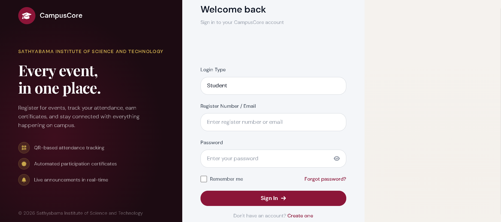
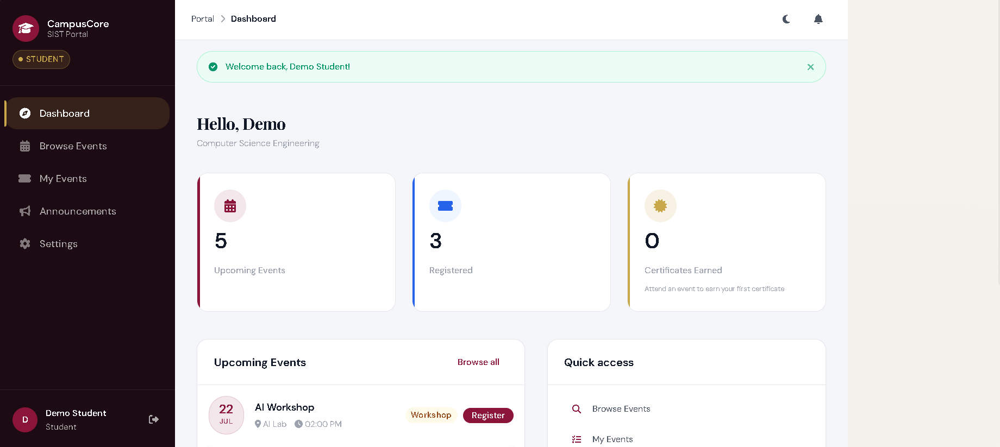
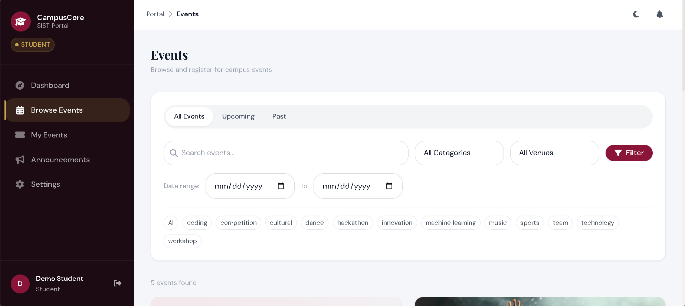
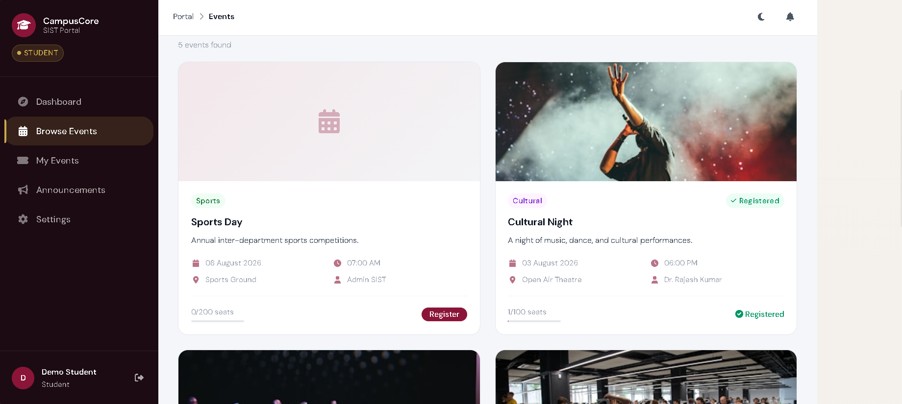
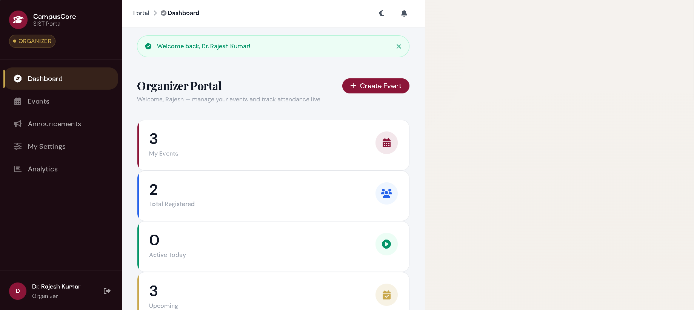
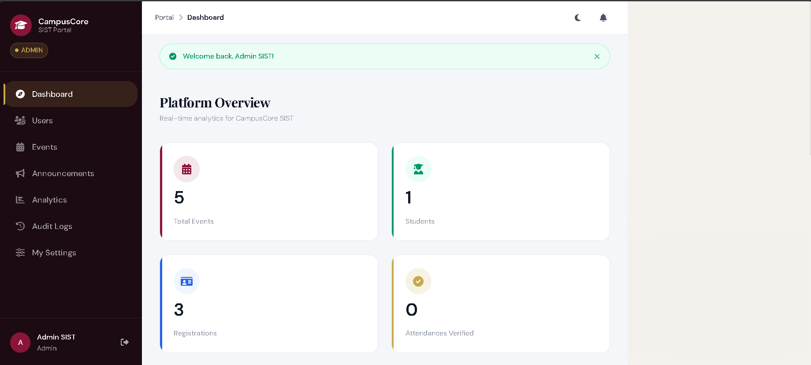
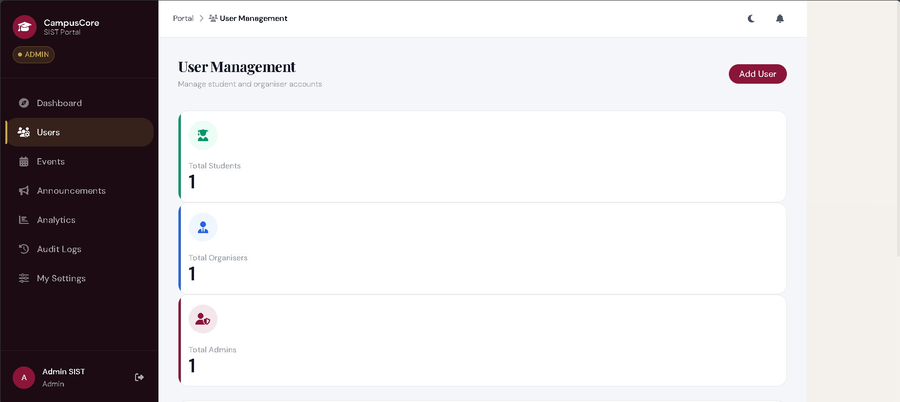
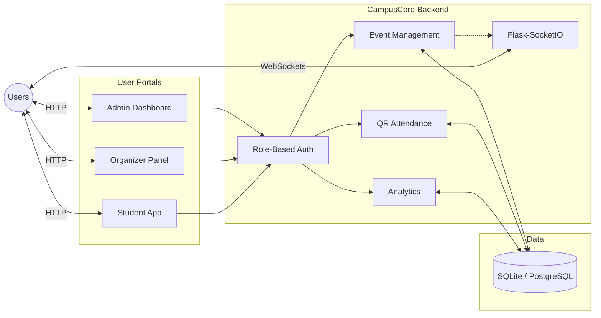

<!-- Project banner -->
<div align="center">
  <h1>🎓 CampusCore</h1>
  <p><strong>Full-stack college event management platform built for SIST</strong></p>

  <!-- Badges -->
  
  
  
  
  
  
</div>

─────

## What is CampusCore?

CampusCore is a comprehensive event management platform tailored for the Sathyabama Institute of Science and Technology (SIST). It elegantly handles the complete event lifecycle—from an organizer creating an event and submitting it for admin approval, to student registration, live QR-based attendance tracking, and automated PDF certificate generation. Built on a robust Python/Flask backend and utilizing SQLite/PostgreSQL with real-time WebSockets, CampusCore delivers a premium Liquid Glass & Crimson/Gold UI that serves three distinct user roles: Students, Organizers, and Admins.

─────

## Screenshots

<table>
  <tr>
    <td><strong>Login Page</strong><br></td>
    <td><strong>Student Dashboard</strong><br></td>
  </tr>
  <tr>
    <td><strong>Student Events (Filters)</strong><br></td>
    <td><strong>Student Events (List)</strong><br></td>
  </tr>
  <tr>
    <td><strong>Organizer Dashboard</strong><br></td>
    <td><strong>Admin Dashboard</strong><br></td>
  </tr>
  <tr>
    <td><strong>Admin Events</strong><br></td>
    <td><strong>Admin Users</strong><br></td>
  </tr>
</table>

─────

## Event Lifecycle

1. 📝 Organizer creates event (Draft)
2. 📤 Organizer submits for approval
3. ✅ Admin approves — event goes live
4. 🎟️ Students register — confirmation email sent
5. 📱 Event day: student presents QR → organizer scans
6. 📡 Live Socket.IO attendance counter updates in real time
7. 🏁 Organizer marks event completed
8. 📜 PDF certificates auto-generated
9. ⬇️ Students download certificates

─────

## Architecture



─────

## Features

| Student | Organizer | Admin |
|---|---|---|
| Browse & register for events | Create and manage events | Approve / reject events |
| Live QR attendance check-in | Real-time Socket.IO attendance counter | Full user CRUD |
| Registration waitlist | Manual + QR check-in modes | Platform announcements |
| Download PDF certificates | Submit events for approval | Analytics dashboard |
| Google OAuth login | Participant list + export | Audit log |
| Live announcement banners | Event statistics | Role management |

─────

## Tech Stack

| Layer | Technology |
|---|---|
| Backend | Python 3.11, Flask 3.0 |
| Database | SQLite (dev) / PostgreSQL (production) |
| ORM | Flask-SQLAlchemy + Alembic migrations |
| Real-time | Flask-SocketIO (eventlet) |
| Auth | Flask-Login + Authlib (Google OAuth) |
| Security | Flask-WTF (CSRF), Flask-Limiter |
| Frontend | Jinja2 SSR, Bootstrap 5, Vanilla JS |
| Design | Custom CSS design system (4 files) |
| Email | Flask-Mail (SMTP) |
| PDF | ReportLab + Pillow |
| Testing | Playwright (17 E2E tests) |

─────

## Quick Start

### Prerequisites
- Python 3.11+
- pip

### 1. Clone & install
```bash
git clone https://github.com/hemanthrajelangovan07-sudo/campuscore.git
cd campuscore
pip install -r requirements.txt
```

### 2. Configure environment
```bash
cp .env.example .env
# Edit .env and fill in your values
```

### 3. Set up the database
```bash
flask db upgrade
```

### 4. Run
```bash
python app_legacy.py
```
The app starts at http://localhost:5000

For production, use Gunicorn:
```bash
pip install gunicorn
gunicorn -w 4 -b 0.0.0.0:5000 "app_legacy:app"
```

─────

## Environment Variables

| Variable | Required | Default | Description |
|---|---|---|---|
| `SECRET_KEY` | Yes | - | Secret key for Flask sessions. Must be a long random string. |
| `DATABASE_URL` | No | `sqlite:///campuscore.db` | Database connection string. Use PostgreSQL in production. |
| `FORCE_HTTPS` | No | `False` | Set to True when SSL is configured to force HTTPS redirects. |
| `PRODUCTION` | No | `False` | Set to True in production for safe error handling. |
| `INJECT_DEMO_DATA` | No | `False` | Seed test accounts on first run. NEVER set to True in production. |
| `ALLOWED_ORIGINS` | No | `http://localhost:5000` | Comma-separated list of allowed origins for CORS. |
| `MAIL_SERVER` | Yes | `smtp.gmail.com` | SMTP server address for sending emails. |
| `MAIL_PORT` | Yes | `587` | SMTP server port. |
| `MAIL_USE_TLS` | Yes | `True` | Use TLS encryption for email. |
| `MAIL_USERNAME` | Yes | - | SMTP username (e.g., your-email@gmail.com). |
| `MAIL_PASSWORD` | Yes | - | SMTP password or app-specific password. |
| `MAIL_DEFAULT_SENDER` | Yes | - | Default "From" address for outbound emails. |
| `QR_SECRET_KEY` | Yes | - | Secret key for hashing QR payload data securely. |
| `GOOGLE_CLIENT_ID` | No | - | Google OAuth Client ID for SSO. |
| `GOOGLE_CLIENT_SECRET` | No | - | Google OAuth Client Secret. |

─────

## Running Tests

```bash
pip install playwright
playwright install chromium
python tests/e2e_playwright.py
```
Expected output: 17/17 tests passing

─────

## Security

- 26-point security audit completed (13-point × 2 passes)
- Rate limiting on /login, /register, /reset-password, QR scan endpoint
- Global CSRF protection (Flask-WTF)
- Parameterised SQL queries via SQLAlchemy (no raw SQL)
- Jinja2 auto-escaping active on all templates
- Session cookies: HttpOnly, SameSite=Lax, Secure (production)
- BOLA protection on all object-level endpoints

─────

## Production Notes

- Switch DATABASE_URL to PostgreSQL for concurrent load
- Set FORCE_HTTPS=True only after SSL is configured on the server
- Set PRODUCTION=True to enable production-safe error handling
- Do not enable INJECT_DEMO_DATA in production (seeds admin123 account)
- Run with Gunicorn or Waitress, not Flask's dev server

─────

## Built By

Kishor G and Hemanth Raj — Department of Computer Science, SIST, 2026
