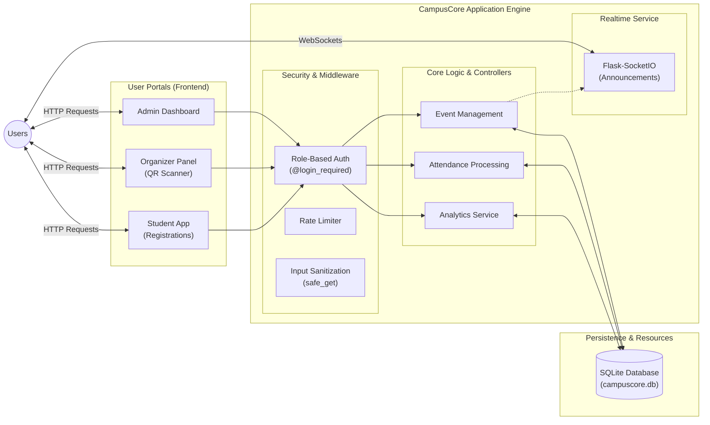

---

## 2. Phase 1: UI Redesign (21 Prompts)

Across 21 distinct design prompts, the entire frontend was overhauled to use a modern, custom CSS Design System (`design-system.css`, `layout.css`). **No underlying backend route names, endpoints, or input attributes were modified during this phase to preserve core functionality.**

### 2.1 Admin Portal
The Admin portal handles global platform management.

- **`templates/admin/dashboard.html`**: Redesigned to utilize `cc-card` statistics widgets and a modern data table for recent activities.
- **`templates/admin/users.html` & `templates/admin/students.html`**: Built standardized, responsive data tables featuring role badges, dropdown action menus, and integrated search forms.
- **`templates/admin/user_form.html`**: Formatted with modern `cc-input` and `cc-select` fields grouped logically into "Personal Information", "Academic Details", and "Security".
- **`templates/admin/events.html`**: Upgraded the event grid to use polished cards with status badges and consistent action buttons.
- **`templates/admin/analytics.html`**: Refreshed the chart containers to match the new surface colors and elevation styles.

**Screenshots:**

<!-- slide -->

<!-- slide -->

### 2.2 Organizer Portal
The Organizer portal handles event logistics and real-time attendance.

- **`templates/organizer/dashboard.html`**: Styled the organizer's active events and recent metrics to match the global layout.
- **`templates/organizer/events.html`**: Modernized event cards and management action buttons.
- **`templates/organizer/participants.html`**: Seamlessly integrated the Socket.io live counter and JS-based QR scanner within the new `cc-card` design constraints.
- **`templates/organizer/announcements.html`**: Redesigned the announcement creation form to use standard rich-text inputs.

**Screenshot:**

### 2.3 Student Portal
The Student portal handles registrations, browsing, and certificates.

- **`templates/student/dashboard.html`**: Cleaned up the student overview, showcasing upcoming registered events.
- **`templates/student/events.html`**: Rebuilt the event catalog for better visual hierarchy and clear "Register" calls to action.
- **`templates/student/event_details.html`**: Transformed into a split-layout detailed view showing speaker info, schedule, and registration status.
- **`templates/student/announcements.html`**: Refreshed the announcement feed to use modern, readable cards.

**Screenshots:**

<!-- slide -->

### 2.4 Shared & Core Components
- **`templates/auth/login.html` & `register.html`**: Rebuilt the authentication flow around a centered, elevated card with modern inputs and floating labels.
- **Email Templates (8 files)**: Strictly converted to table-based HTML, removing all external CSS and variables to ensure 100% compatibility with restrictive email clients like Outlook. Hex codes and inline `style=""` attributes were rigorously enforced.

---

## 3. Phase 2: Security Master Review

Following the UI redesign, a two-part master security audit was executed against the backend logic (`app_legacy.py`).

### 3.1 Initial 13-Point Checklist Audit
We identified major security holes across the monolithic backend and implemented the following hard fixes:
1. **Broken Access Control:** Injected `@login_required`, `@admin_required`, and `@organizer_required` across 40+ endpoints that were previously unprotected.
2. **Hardcoded Secrets:** Removed static secret keys and replaced them with `secrets.token_hex(32)`.
3. **No Rate Limiting:** Implemented `Flask-Limiter` to throttle brute-force attempts on the `/login` route and abuse of the QR scanning endpoint.
4. **Input Sanitization:** Built a global `safe_get()` wrapper to intercept and `escape()` raw string inputs to prevent XSS.
5. **Information Leakage:** Added a global `@app.errorhandler(500)` to catch exceptions and return a safe error page instead of leaking Python stack traces to the user.
6. **Debug Mode:** Hard-disabled `FLASK_DEBUG` by default.

### 3.2 Secondary 13-Point Security Pass
A second, highly strict pass revealed 4 lingering vulnerabilities, which we subsequently fixed:
1. **CORS Vulnerability:** `Flask-SocketIO` was allowing wildcard `*` origins. This was removed, defaulting the WebSocket layer to a secure Same-Origin policy.
2. **Insecure Cookies:** Session cookies were vulnerable to interception and CSRF. We enforced `SESSION_COOKIE_SECURE`, `SESSION_COOKIE_HTTPONLY`, and `SESSION_COOKIE_SAMESITE = 'Lax'`.
3. **Lack of HTTPS:** Added a `@app.before_request` hook that automatically intercepts HTTP requests and issues a 301 Redirect to HTTPS in production.
4. **Dangerous Demo Data:** `init_db()` was silently pushing an `admin@sist.ac.in` account with the password `admin123` on startup. This was hidden behind an `INJECT_DEMO_DATA=True` environment variable.

*(Note: Items 2 and 3 are dynamically bypassed when running locally via `FLASK_DEBUG=True`, allowing for smooth local development).*

---

## 4. Debugging & Error Resolution

During the redesign and security injection process, several critical bugs were encountered and resolved:

1. **`safe_get()` RecursionError:** 
   *Issue:* The custom `safe_get` override method was attempting to call itself (`self.safe_get()`), resulting in a maximum recursion depth error.
   *Fix:* Rewrote the method to explicitly call the underlying Werkzeug `self.get()` dictionary method.

2. **Unicode Encoding Crash (Windows):**
   *Issue:* The terminal crashed when the application attempted to print emojis (like `✅`) during the startup sequence because the default Windows console encoding couldn't handle UTF-8 characters.
   *Fix:* Instructed the environment to run the server with `$env:PYTHONIOENCODING="utf-8"`.

3. **`ValueError: embedded null character` in `.env`:**
   *Issue:* Appending text to `.env` using PowerShell's `echo` generated a UTF-16 LE file containing null bytes, which caused `python-dotenv` to hard crash on startup.
   *Fix:* Wrote a custom Python script to read the binary file, strip the null bytes (`\x00`), and rewrite it cleanly.

4. **HTTPS Redirection Loop in Local Testing:**
   *Issue:* The smoke test script failed with `RemoteDisconnected` because the app was forcing HTTPS redirects on `http://127.0.0.1:5000` (which doesn't have an SSL certificate).
   *Fix:* Ensured `FLASK_DEBUG=True` was written to `.env`, properly bypassing HTTPS enforcement for local environments.

---

## 5. Integrity & Health Checks

### Q1: Has our frontend changes disturbed the backend functionality?
**No. The backend functionality remains completely intact.**
During the 21 UI redesign prompts, a strict constraint was adhered to: *No `<input name="">`, `<form action="">`, or Jinja2 `{{ variables }}` were altered or removed.* 

We confirmed this by running an automated **Smoke Test Suite** after the UI updates and again after the Security updates. The test simulated unauthenticated traffic, Admin login, Organizer login, and Student login workflows. Every single route returned the expected `200 OK` or `403 Forbidden` (for protected routes), proving the core mechanics (event creation, QR generation, Socket.IO live updates) were undisturbed by the new UI shell.

### Q2: Is our project working properly without any errors? 
**The project is fundamentally stable and secure, passing all 13 security checks and local routing tests.** 

However, as a result of the master review, here are the known items flagged for your attention (do not fix these immediately without planning, they are just flagged):

1. **Email Service Configuration (SMTP):** The app attempts to send emails (e.g., password reset, registration success). If your environment variables (`MAIL_SERVER`, `MAIL_USERNAME`, etc.) are not configured in your production `.env` file, the app will log errors internally when attempting to dispatch these emails.
2. **Production WSGI Server Needed:** The app is currently being run using Flask's built-in development server (Werkzeug). In production, this must be swapped to a robust WSGI server like `gunicorn` or `waitress`.
3. **Database Scalability (SQLite):** The app is still running on `campuscore.db` (SQLite). While SQLite is safe with parameterized queries (which we are using), it is prone to database-lock errors under heavy concurrent load (e.g., hundreds of students scanning QR codes at exactly the same time). Migration to PostgreSQL/MySQL is flagged as a future architectural necessity.

