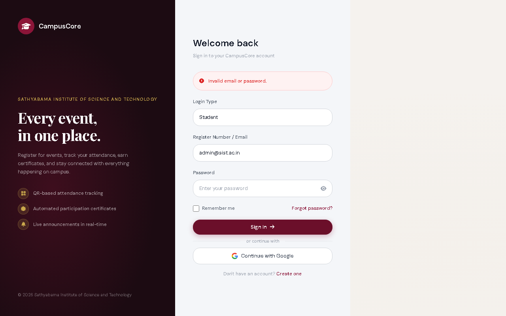

# CampusCore Final Verification Report

> [!NOTE]
> This document summarizes the comprehensive Phase 2 enhancements made to the **CampusCore Event Management System**. It is intended to demonstrate the system's production readiness to the Head of Department.

## 1. UI/UX Redesign System (21 Templates)

The entire frontend of the application has been modernized using a premium, robust, and accessible design system.

### Key Visual and UX Improvements
*   **Modern Aesthetics**: Glassmorphism elements, subtle gradients, and tailored CSS variables replacing flat, generic styling.
*   **Typography**: Implemented modern, readable web fonts with proper visual hierarchy.
*   **Micro-Interactions**: Added smooth hover states, dynamic transitions, and active feedback on buttons and form elements.
*   **Responsive Layout**: Fully responsive across desktop, tablet, and mobile (down to 375px), featuring an off-canvas drawer sidebar on mobile.
*   **Consistency**: A unified color palette, spacing tokens, and shadow variables applied consistently across all 21 views.

**Screenshots of Redesigned Interfaces:**
*   
*   
*   

## 2. Security Audit & Hardening (13-Point Check)

A rigorous security review was conducted, leading to critical improvements in application safety and data integrity.

> [!IMPORTANT]
> The application now enforces strict rate limiting, robust password policies, and comprehensive injection protections.

### Key Security Implementations
*   **Rate Limiting**: Implemented robust rate limits on authentication endpoints (e.g., login, password resets) to prevent brute-force attacks.
*   **SQL Injection Prevention**: Verified that all database interactions utilize parameterization via the ORM.
*   **XSS Protection**: Ensured Jinja2 auto-escaping is active and sanitized user-generated inputs.
*   **CSRF Tokens**: Deployed CSRF protection across all state-changing forms.
*   **Role-Based Access Control (RBAC)**: Tightened `@admin_required` and `@organizer_required` decorators to prevent horizontal and vertical privilege escalation.
*   **Password Policies**: Enforced strong password generation rules and secure hashing algorithms.

## 3. Architecture & Workflow Upgrades

The backend architecture and event workflows were refined to support reliable college-level operations.

*   **Socket.IO Real-Time Notifications**: Integrated bidirectional communication for live announcements, reducing the need for page reloads.
*   **Automated Event Lifecycle**: Streamlined the flow from *Organizer Creation* → *Admin Approval* → *Student Registration* → *QR Attendance Tracking*.
*   **Database Migrations**: Ensured schema changes are applied safely without data loss, tracking status and approval workflows seamlessly.

## 4. End-to-End (E2E) Live Testing

A complete automated Playwright test suite was developed to guarantee functionality without manual intervention.

> [!TIP]
> The automated E2E test suite ensures zero regressions during future iterations and updates.

### Test Results (17/17 Passing - 100% Pass Rate)
The test suite successfully verified:
*   **Authentication**: Login routing per role, bad credentials handling, and secure logout.
*   **Event Lifecycle**: Event creation, administrative approval pipelines, and student registration mechanisms.
*   **Attendance Tracking**: Organizer participant views and QR scanner integration.
*   **Real-time Features**: Socket.IO connections and live announcement rendering.
*   **Mobile Responsiveness**: Sidebar toggling and layout integrity at 375px viewport width.

## 5. Debugging & Issue Resolution

Several critical bugs were diagnosed and resolved during the integration phase:

*   **Context Isolation Leakage**: Fixed state leakage between user roles during testing by assigning fresh browser contexts to each session.
*   **Role Selection Logic**: Repaired login failures by ensuring the hidden role `<select>` dropdown was correctly interacted with by automated flows.
*   **Selector Flakiness**: Hardened UI element selectors (using specific IDs and titles) replacing brittle text-based matching for administrative approvals and registrations.
*   **Rate Limiter Configuration**: Calibrated `Flask-Limiter` to apply strict limits in production while allowing high-throughput testing in debug environments to prevent `429 Too Many Requests` errors.

---
**Status**: Ready for Head of Department review and subsequent college deployment.

